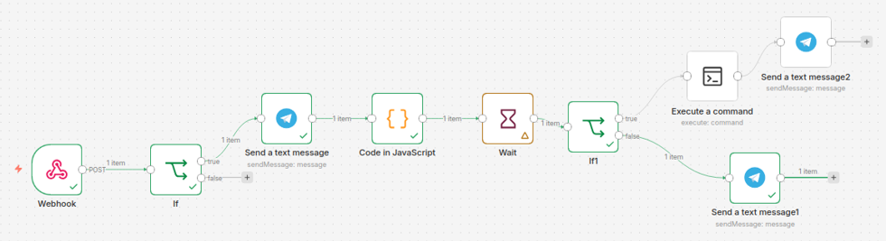
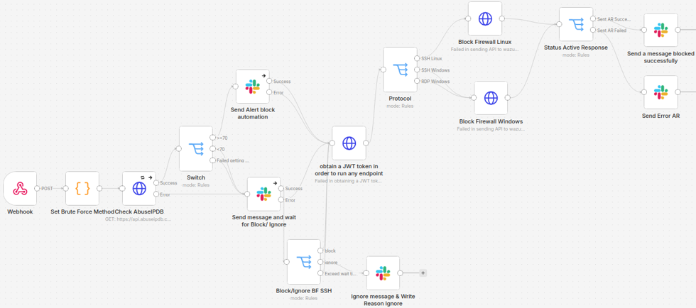
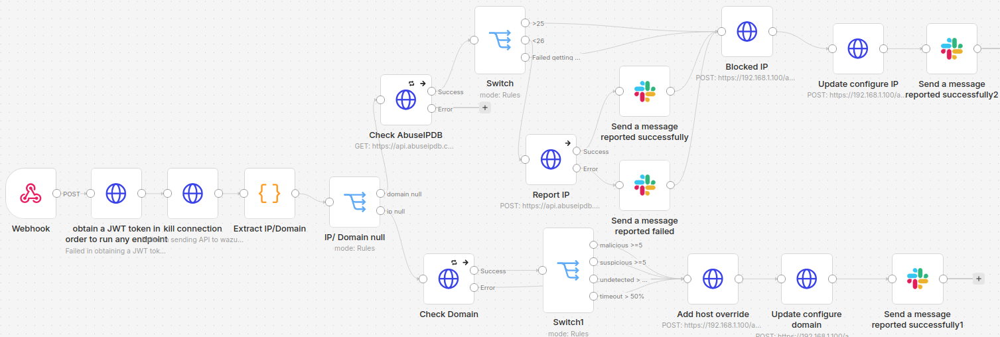
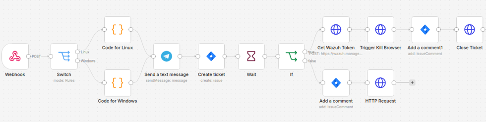
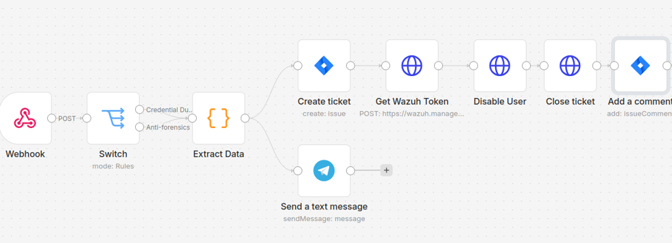

# SOAR Playbooks

## Playbook 1: Privilege Escalation Monitoring
- Detects when a user is added to an administrative group, which may indicate privilege escalation.
- Generates an alert to administrators and allows them to review and approve the response before any intervention is taken.

## Playbook 2: Brute-Force Attack Response
- Identifies abnormal sequences of failed login attempts over SSH or RDP.
- Assesses the risk level of the source IP and automatically blocks the attacker when the threshold is exceeded.

## Playbook 3: Web Shell / Backdoor Response
- Detects malicious web shell activity and suspicious bash execution.
- Disconnects the attacker and adds the source IP to the blocklist on OPNsense.

## Playbook 4: Suspected Internal Data Exfiltration Detection
- Monitors access to sensitive files on both Windows and Linux systems.
- Detects suspicious data-access behavior, records the incident for investigation, and requires administrator approval before blocking to avoid false positives.

## Playbook 5: Credential Dumping and Anti-Forensics Detection on Linux
- Detects unauthorized access to system password files and log deletion activities.
- Classifies the severity of each event, blocks the offending account, and preserves evidence centrally even if local logs are removed.

